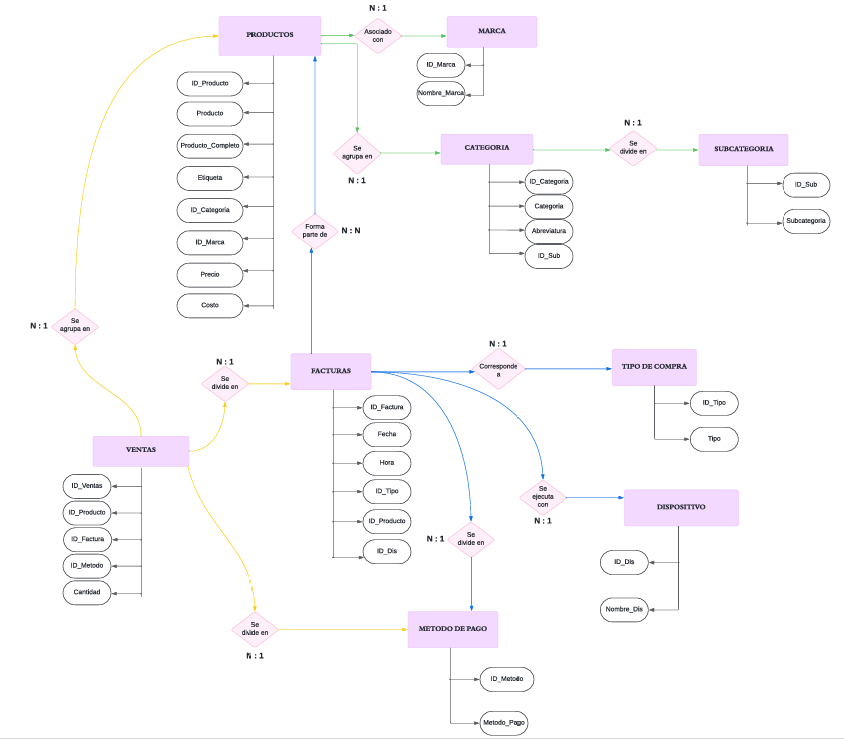
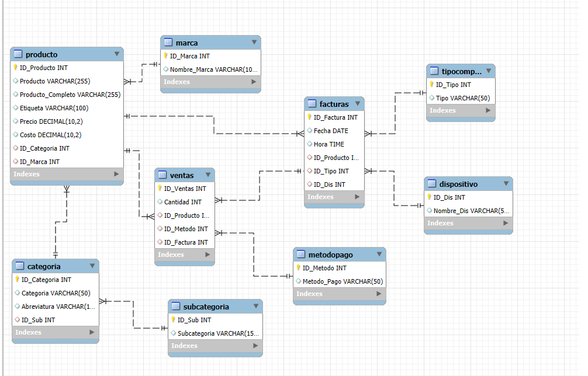

# Análisis de Base de Datos de Supermercado

### _Introducción_

En el presente trabajo se analiza una base de datos extensa que abarca diez años de transacciones realizadas en un supermercado, desde 2010 hasta 2020. Este período incluye una variedad de ciclos económicos, cambios en los patrones de consumo y eventos significativos a nivel global, como la pandemia de COVID-19. La base de datos proporciona un registro detallado de las compras de los clientes, incluyendo información sobre productos, cantidades, precios y fechas de las transacciones.

### _Objetivo_

El objetivo principal de este análisis es explorar y extraer información significativa de los datos históricos para identificar tendencias y patrones de consumo a lo largo del tiempo. Se busca comprender cómo las variables externas e internas han influido en los comportamientos de compra, así como evaluar el impacto de eventos específicos en las mismas. Esto nos permitirá optimizar el negocio aprovechando datos recopilados durante una década de transacciones comerciales además se pueden tomar mejores decisiones sobre la oferta de productos, la gestión del inventario y las estrategias de marketing. El análisis de datos históricos puede proporcionar una perspectiva valiosa sobre cómo adaptarse a futuros cambios en el mercado y mejorar la competitividad del supermercado.

### _Alcance_

El análisis está dirigido principalmente a:

1. *_Gerente del Supermercado_*: Proporciona información clave para la toma de decisiones estratégicas sobre la gestión del inventario, la planificación de promociones y la adaptación de la oferta de productos según las tendencias del mercado.
2. *_Analistas de Datos_*: Ofrece datos y perspectivas útiles para la elaboración de recomendaciones basadas en análisis cuantitativos, así como para la formulación de estrategias comerciales y de marketing.

### _Nivel de Aplicación_

- *_Táctico_*: En el corto plazo, los resultados pueden aplicarse para ajustar estrategias promocionales y optimizar la gestión del inventario en función de los patrones de compra identificados.
- *Estratégico*: En el largo plazo, el análisis proporciona una visión integral de las tendencias del mercado y los cambios en los hábitos de consumo, permitiendo a los gerentes planificar a futuro, adaptar las estrategias de negocio y mejorar la competitividad del supermercado en un entorno en constante cambio.

# _Diagrama Entidad Relacion Lucidchart_

# _Diagrama Entidad Relacion MySQL_

# <u>LISTADO DE TABLAS</u>

Detallo a continuación cada tabla conformada por su PK, FK y además una breve reseña de cada una.

1. <u>Producto</u>: Representa los productos disponibles para la venta. Contiene información detallada sobre cada producto.  
   *Atributos:*  
   - ✔ *ID_Producto* (PK)  
   - ✔ Producto  
   - ✔ Producto completo  
   - ✔ Etiqueta  
   - ✔ ID_categoria (FK)  
   - ✔ ID_marca (FK)  
   - ✔ Precio  
   - ✔ Costo  

2. <u>Marcas</u>: Esta tabla contiene información sobre la marca de los productos.  
   *Atributos:*  
   - ✔ *ID_marca* (PK)  
   - ✔ Nombre_Marca  

3. <u>Categoría</u>: Agrupa los productos en categorías generales.  
   *Atributos:*  
   - ✔ *ID_Categoria* (PK)  
   - ✔ Categoría  
   - ✔ Abreviatura  
   - ✔ ID_Sub (FK)  

4. <u>Subcategoría</u>: Agrupa los productos en categorías específicas.  
   *Atributos:*  
   - ✔ *ID_Sub* (PK)  
   - ✔ Subcategoría  

5. <u>Tipo de compra</u>: Detalla si la compra fue realizada de manera física en el supermercado o en línea desde la página web.  
   *Atributos:*  
   - ✔ *ID_tipo* (PK)  
   - ✔ Tipo  

6. <u>Método de pago</u>: Indica las metodologías que utilizó el cliente para realizar sus compras (Transferencia, Débito, Crédito, Efectivo, QR).  
   *Atributos:*  
   - ✔ *ID_Metodo* (PK)  
   - ✔ Metodo_Pago  

7. <u>Dispositivos</u>: Indica los dispositivos utilizados para ejecutar el pago de cada compra (PC, Tablet, Celular).  
   *Atributos:*  
   - ✔ *ID_Dis* (PK)  
   - ✔ Nombre_Dis  

8. <u>Factura</u>: Registra la información de las facturas emitidas, incluyendo fecha y hora de cada transacción.  
   *Atributos:*  
   - ✔ *ID_Factura* (PK)  
   - ✔ Fecha  
   - ✔ Hora  
   - ✔ ID_Producto (FK)  
   - ✔ ID_tipo (FK)  
   - ✔ ID_Dis (FK)  

9. <u>Ventas</u>: Esta tabla registra las ventas realizadas, incluyendo la cantidad vendida y la información relevante sobre el producto y la transacción.  
   *Atributos:*  
   - ✔ *ID_Ventas* (PK)  
   - ✔ ID_Producto (FK)  
   - ✔ ID_Factura (FK)  
   - ✔ Cantidad 
   - ✔ ID_Metodo (FK)

# <u>LISTADO DE COLUMNA DE CADA TABLA</u>  

A continuación, se hará mención de las columnas que posee cada tabla junto con su tipo de campo y clave:

<table>
  <tr>
    <th rowspan="9">PRODUCTO</th>
    <th>Campo</th>
    <th>Tipo de Campo</th>
    <th>Tipo de Clave</th>
  </tr>
  <tr>
    <td>ID_Producto</td>
    <td>INT / NOT NULL / AUTO_INCREMENT </td>
    <td>PK</td>
  </tr>
  <tr>
    <td>Producto</td>
    <td>VARCHAR (255)</td>
    <td>-</td>
  </tr>
  <tr>
    <td>Producto_Completo</td>
    <td>VARCHAR (255)</td>
    <td>-</td>
  </tr>
  <tr>
    <td>Etiqueta</td>
    <td>VARCHAR (100)</td>
    <td>-</td>
  </tr>
  <tr>
    <td>ID_Categoría</td>
    <td>VARCHAR (20)</td>
    <td>FK</td>
  </tr>
  <tr>
    <td>ID_Marca</td>
    <td>INT / NOT NULL</td>
    <td>FK</td>
  </tr>
  <tr>
    <td>Precio</td>
    <td>DECIMAL (10,2)</td>
    <td>-</td>
  </tr>
  <tr>
    <td>Costo</td>
    <td>DECIMAL (10,2)</td>
    <td>-</td>
  </tr>
</table>

<table>
  <tr>
    <th rowspan="7">FACTURA</th>
    <th>Campo</th>
    <th>Tipo de Campo</th>
    <th>Tipo de Clave</th>
  </tr>
  <tr>
    <td>ID_Factura</td>
    <td>INT / NOT NULL / AUTO_INCREMENT</td>
    <td>PK</td>
  </tr>
  <tr>
    <td>Fecha</td>
    <td>DATE</td>
    <td>-</td>
  </tr>
  <tr>
    <td>Hora</td>
    <td>TIME</td>
    <td>-</td>
  </tr>
  <tr>
    <td>ID_Tipo</td>
    <td>INT / NOT NULL</td>
    <td>FK</td>
  </tr>
  <tr>
    <td>ID_Producto</td>
    <td>INT / NOT NULL</td>
    <td>FK</td>
  </tr>
  <tr>
    <td>ID_Dis</td>
    <td>INT / NOT NULL</td>
    <td>FK</td>
  </tr>
</table>

<table>
  <tr>
    <th rowspan="6">VENTAS</th>
    <th>Campo</th>
    <th>Tipo de Campo</th>
    <th>Tipo de Clave</th>
  </tr>
  <tr>
    <td>ID_Ventas</td>
    <td>INT / NOT NULL / AUTO_INCREMENT</td>
    <td>PK</td>
  </tr>
  <tr>
    <td>ID_Producto</td>
    <td>INT / NOT NULL</td>
    <td>FK</td>
  </tr>
  <tr>
    <td>ID_Factura</td>
    <td>INT / NOT NULL</td>
    <td>FK</td>
  </tr>
  <tr>
    <td>ID_Metodo</td>
    <td>INT / NOT NULL</td>
    <td>FK</td>
  </tr>
  <tr>
    <td>Cantidad</td>
    <td>INT</td>
    <td>-</td>
  </tr>
</table>

<table>
  <tr>
    <th rowspan="3">TIPO</th>
    <th>Campo</th>
    <th>Tipo de Campo</th>
    <th>Tipo de Clave</th>
  </tr>
  <tr>
    <td>ID_Tipo</td>
    <td>INT / NOT NULL / AUTO_INCREMENT</td>
    <td>PK</td>
  </tr>
  <tr>
    <td>Tipo</td>
    <td>VARCHAR (50)</td>
    <td>-</td>
  </tr>
</table>

<table>
  <tr>
    <th rowspan="3">MARCA</th>
    <th>Campo</th>
    <th>Tipo de Campo</th>
    <th>Tipo de Clave</th>
  </tr>
  <tr>
    <td>ID_Marca</td>
    <td>INT / NOT NULL / AUTO_INCREMENT</td>
    <td>PK</td>
  </tr>
  <tr>
    <td>Nombre_Marca</td>
    <td>VARCHAR (100)</td>
    <td>-</td>
  </tr>
</table>

<table>
  <tr>
    <th rowspan="5">CATEGORIA</th>
    <th>Campo</th>
    <th>Tipo de Campo</th>
    <th>Tipo de Clave</th>
  </tr>
  <tr>
    <td>ID_Categoria</td>
    <td>INT / NOT NULL / AUTO_INCREMENT</td>
    <td>PK</td>
  </tr>
  <tr>
    <td>Categoría</td>
    <td>VARCHAR (50)</td>
    <td>-</td>
  </tr>
  <tr>
    <td>Abreviatura</td>
    <td>VARCHAR (10)</td>
    <td>-</td>
  </tr>
  <tr>
    <td>ID_Sub</td>
    <td>INT / NOT NULL</td>
    <td>FK</td>
  </tr>
</table>

<table>
  <tr>
    <th rowspan="3">SUBCATEGORIA</th>
    <th>Campo</th>
    <th>Tipo de Campo</th>
    <th>Tipo de Clave</th>
  </tr>
  <tr>
    <td>ID_Sub</td>
    <td>INT / NOT NULL / AUTO_INCREMENT</td>
    <td>PK</td>
  </tr>
  <tr>
    <td>Subcategoría</td>
    <td>VARCHAR (150)</td>
    <td>-</td>
  </tr>
</table>

<table>
  <tr>
    <th rowspan="3">DISPOSITIVO</th>
    <th>Campo</th>
    <th>Tipo de Campo</th>
    <th>Tipo de Clave</th>
  </tr>
  <tr>
    <td>ID_Dis</td>
    <td>INT / NOT NULL / AUTO_INCREMENT</td>
    <td>PK</td>
  </tr>
  <tr>
    <td>Nombre_Dis</td>
    <td>VARCHAR (50)</td>
    <td>-</td>
  </tr>
</table>

<table>
  <tr>
    <th rowspan="3">MÉTODO DE PAGO</th>
    <th>Campo</th>
    <th>Tipo de Campo</th>
    <th>Tipo de Clave</th>
  </tr>
  <tr>
    <td>ID_Metodo</td>
    <td>INT / NOT NULL / AUTO_INCREMENT</td>
    <td>PK</td>
  </tr>
  <tr>
    <td>Metodo_Pago</td>
    <td>VARCHAR (50)</td>
    <td>-</td>
  </tr>
</table>

---

# <u>INSERCION DE DATOS</u>

Con el fin de continuar con el proceso de aprendisaje y corresponder a la segunda entrega del curso de SQL, se avanzo con la insercion de datos en la Base de datos creada en la anterior entrega, para validar el correcto funcionamiento tanto de las relaciones entre las tablas, la creacion de Vistas, Triggers, Funciones y Store Procedures. 
Para no hacer de este documento algo muy extenso se pueden consultar los distintos INSERT en el archivo "insertSegundaEntrega.sql" en la carpeta "SegundaEntrega_MySQL".

